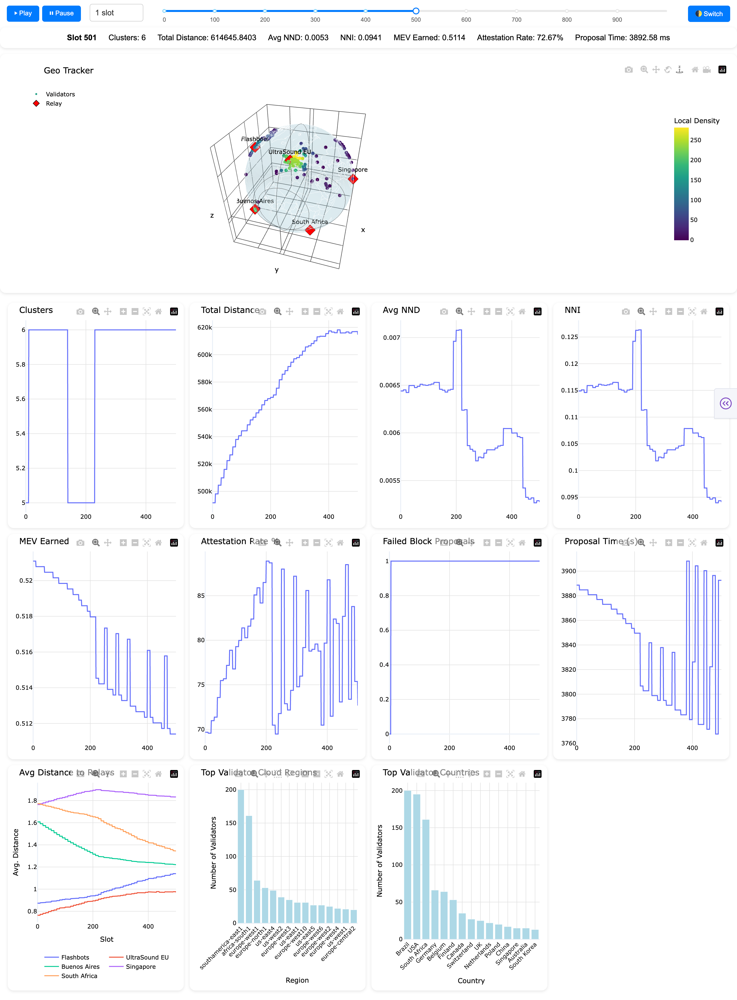

# Geographical Decentralization Simulation

## Installation

Please install Python and the dependencies by running the following command:
```shell
pip install -r requirements.txt
```

## Usage

```shell
# run the simulation, and the output is the locations of nodes in each slot (data.json)
python3 simulation.py --config params/world-relay.yaml
# run the simulation in a fast mode (skip distribution and related computation)
python3 simulation.py --config params/world-relay.yaml --fast
# run the visualization based on the output file
python3 visualization.py --output world-relay
```

When running `visualization.py`, a Flask app will open at `http://127.0.0.1:8050/` for visualization.



Note: In the current version, there is a single relay, and the nodes (proposers) choose the best location to minimize their latency by colocating with the relay. They also know how to maximize utility by waiting until the last seconds to propose the block.


## Measure of Geographical Decentralization

- Number of Clusters
    - Description: This refers to the total count of distinct groups identified by a clustering algorithm (e.g., DBSCAN). 
- Total Distance
    - Description: The sum of all pairwise distances between every point.
- Average Nearest Neighbor Distance (NND): 
    - Description: This is the average of the distances from each point to its closest neighboring point. For each point $i$ of $N$ points, find the shortest distance to any other point j (where $j \neq i$). Then, sum these shortest distances and divide by the total number of points ($N$). 
    $$
    \text{Average NND} = \frac{\sum_{i=1}^{N} \min_{j \neq i} (d_{ij})}{N}
    $$
    - Significance: A small average nearest neighbor distance suggests that points are generally close to each other, indicating a tendency towards clustering.
- Average Nearest Neighbor Index (NNI):
    - Description: This is a ratio that compares the observed average nearest neighbor distance to the expected average nearest neighbor distance if the points were randomly distributed within the same area.
    The formula is:
    $$
    \text{NNI} = \frac{\text{Average NND}}{\text{Average Expected NND}}
    $$
    The expected average nearest neighbor distance for a random distribution (Complete Spatial Randomness, CSR) is often calculated as:
    $$
    \text{Expected NND} = \frac{1}{2 \sqrt{\lambda}} \quad \text{or} \quad \frac{1}{2 \sqrt{N/A}}
    $$
    where $\lambda$ is the density of points (number of points $N$ divided by the area $A$).
    - Significance: `NNI < 1` suggests that points are clustered - the observed average nearest neighbor distance is less than the expected distance. A value closer to 0 indicates stronger clustering.


## Code Structure

- `constants.py`: Constants.
- `distribution.py`: The code to generate the distribution of nodes. The current version is based on Quintus's [code](https://github.com/quintuskilbourn/geoDecSim/).
- `measure.py`: The measure of geographical decentralization.
- `simulation.py`: Simulation code.
- `visualization.py`: Visualization code.

## Workflow

The current implementation is based on a simplified MEV-Boost auction with timing games, i.e., the proposer selects the block from the relay after the beginning of the slot.


The latency between when the proposer requests a block and when an attestor receives the block could be:

- Assuming the relay is the only information source:
    - `3 * latency_proposer_to_relay + latency_relay_to_attestor`
    - `2 * latency_proposer_to_relay + latency_relay_to_attestor` (assuming the proposer knows the expected reward from the relay, so the latency only includes two parts: receiving the header from the relay and sending the submitted header back to the relay)
- Considering that the proposer and the attestors also broadcast the block, the latency may need to take the network topology into account.